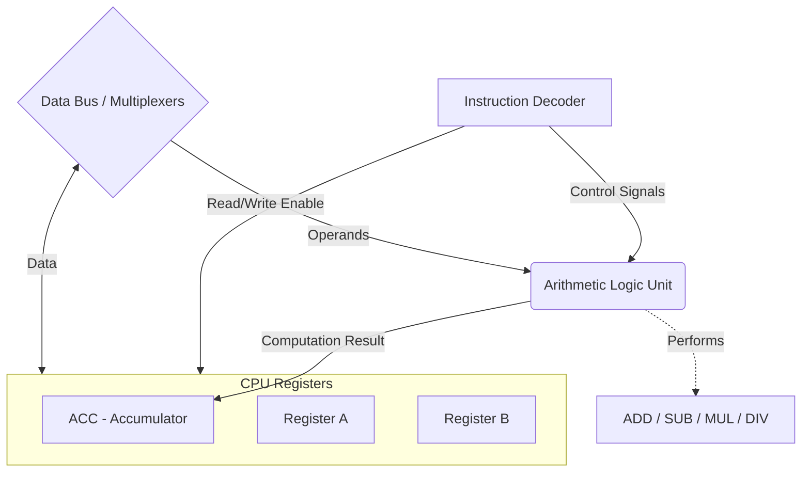
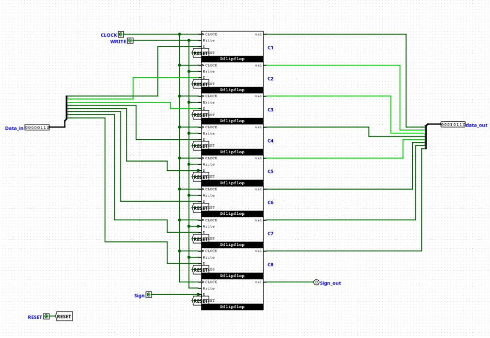
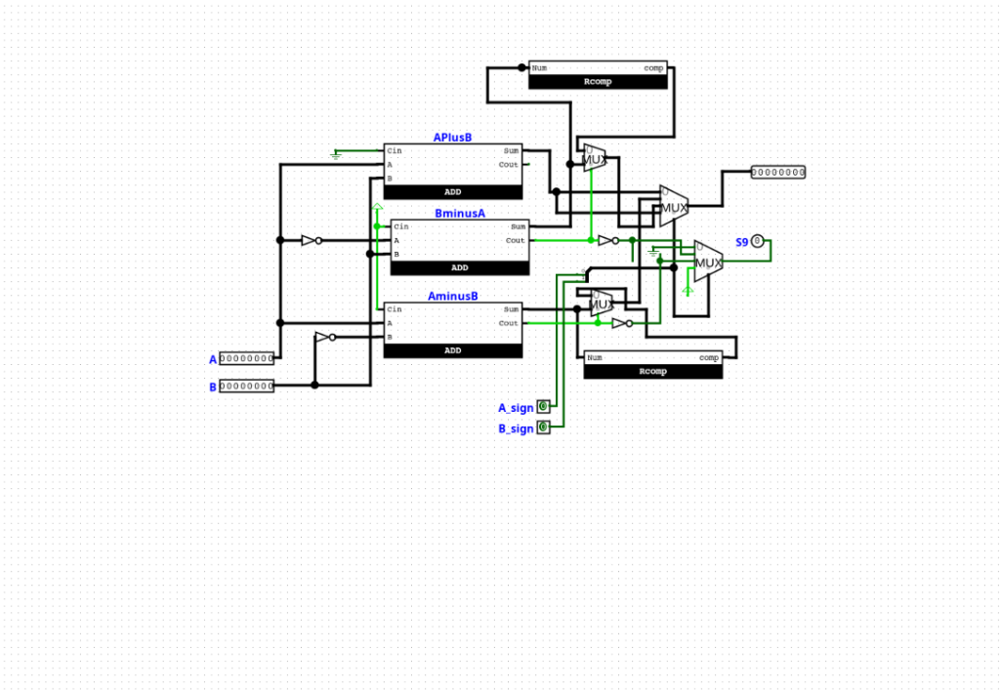
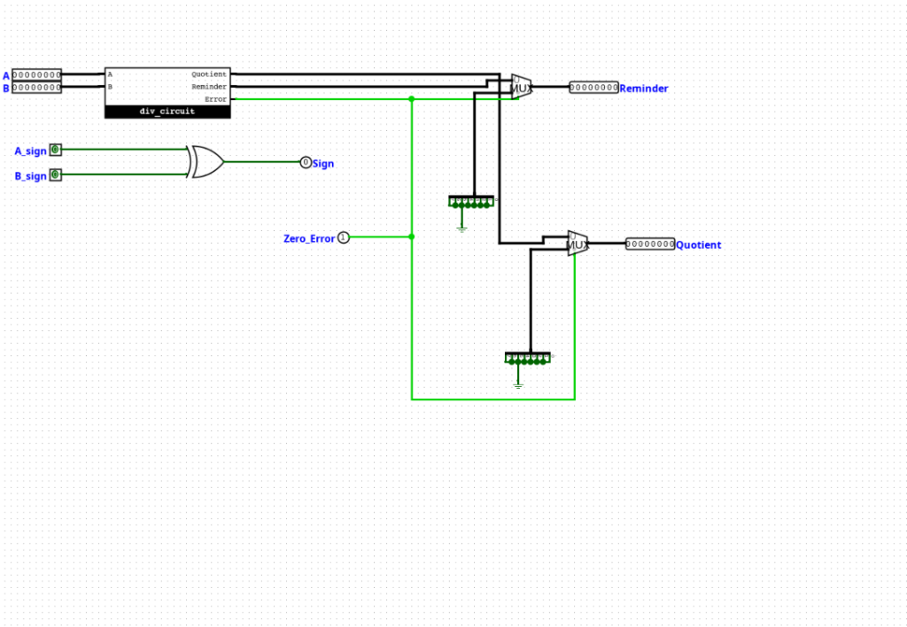
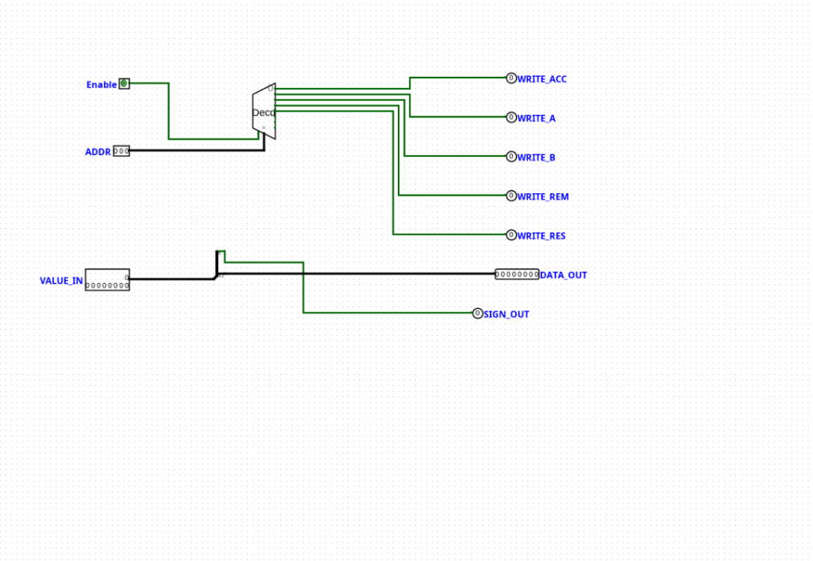
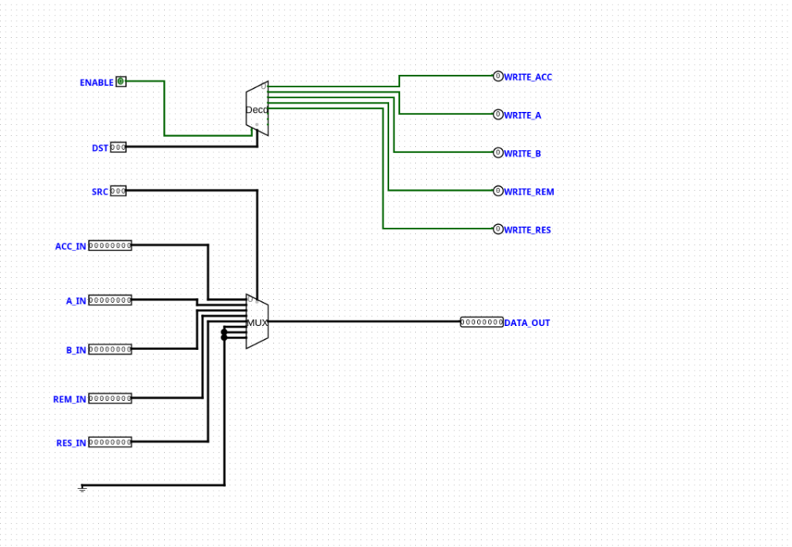

# ALUForge

ALUForge is a custom single-core CPU designed from scratch. The project focuses on building a full-fledged processor architecture from the ground up, including the design of the Arithmetic Logic Unit (ALU), datapath, control unit, and a custom Instruction Set Architecture (ISA).

## Key Features

- **Registers**: Built with three primary working registers:
  - **ACC (Accumulator)**: Acts as the primary register for arithmetic and logic results.
  - **A & B**: General-purpose registers for storing operands.
- **Instruction Set Architecture (ISA)**: Supports multiple instruction formats for flexibility:
  - **0-address**: Implicit operands (e.g., operations working directly on the Accumulator).
  - **1-address**: Single explicit operand.
  - **2-address**: Two explicit operands (typically source and destination).
  - **3-address**: Three explicit operands (two sources and one destination).
- **Supported Operations**: Includes essential instructions like `MOV` (data transfer), `ADD`, `SUB`, `MUL`, and `DIV`.

## Circuit Diagrams & Modules Completed

The digital logic design is implemented using Logisim (saved as `.circ` files). The development follows a modular approach, starting from basic memory elements and progressing to complex arithmetic components. The following modules have been completed:

### 1. Memory and Registers (`register.circ`)
- **Dflipflop**: The foundational 1-bit memory cell (D-type flip-flop) built using logic gates.
- **registor**: A multi-bit register module constructed by cascading `Dflipflop` instances. This forms the basis for the CPU's ACC, A, and B registers.

### 2. Arithmetic Logic Unit (ALU) Components
Arithmetic components are divided across multiple circuit files to ensure modularity and ease of testing.
- **Addition (`FinalCircuit.circ`)**:
  - **ADD_full / SUM**: A standard 1-bit full adder to compute the sum and carry of two bits.
  - **ADD**: A multi-bit ripple-carry adder that combines several `ADD_full` units.
- **Subtraction (`FullSubtracter.circ`)**:
  - **Full_Subtracter & mainFullSubtracter**: Dedicated circuits that handle multi-bit subtraction using borrow logic.
- **Complement & Utilities (`FinalCircuit.circ`)**:
  - **Rcomp**: A complement module designed to facilitate 1's or 2's complement operations, which are essential for subtraction and handling negative binary numbers.
- **Division (`FinalCircuit.circ`)**:
  - **DIV**: An 8-bit unsigned division module that computes the quotient and remainder of two 8-bit numbers.
  - **DIVIDE**: The top-level signed division circuit. It takes two 8-bit operands (`A` and `B`) along with their 1-bit signs (`A_sign` and `B_sign`), executes division through `DIV`, and outputs the final 8-bit quotient and its sign (`Sign`).

### 3. Control Unit & Top-Level Integration (`FinalCircuit.circ`)
- **decode**: The instruction decoder module. It takes the binary instruction format, determines the addressing mode (0, 1, 2, or 3-address), and asserts the correct control signals across the CPU.
- **ALUForge**: The top-level master circuit. This integrates the ALU components, the registers, and the instruction decoder, completing the datapath and routing the control signals to orchestrate the CPU's execution cycle.

## Architecture Block Diagram
Below is a high-level conceptual overview of the ALUForge datapath and control unit interactions:

## Schematic Diagrams (Logisim)

Below are the circuit schematics built in Logisim for the ALUForge CPU architecture:

### Register / Memory Block (8-bit Register)
This 8-bit register is constructed using 8 independent D Flip-Flop cells. It includes common `CLOCK`, `WRITE` enable, and `RESET` lines.

### ALU - Addition and Subtraction
This circuit performs arithmetic operations, combining addition (`APlusB`) and subtraction (`AminusB`, `BminusA`) by utilizing the basic `ADD` component and complement blocks (`Rcomp`).

### ALU - Division Circuit
This top-level signed division module uses a base division circuit to compute quotient and remainder, along with an XOR gate to determine the final sign based on the operands' signs.

### Control Unit - Decoder (Register Write)
This part of the decoder takes an instruction and asserts the correct `WRITE` enable signals for the CPU's registers (ACC, A, B, REM, RES).

### Control Unit - Decoder (Register Read)
This multiplexer-based decoder section selects which register's data (ACC, A, B, REM, RES) is sent onto the main data bus.

